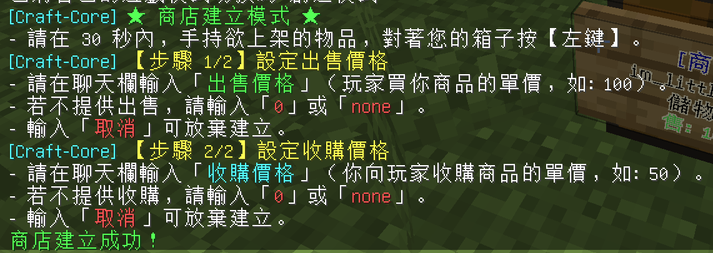
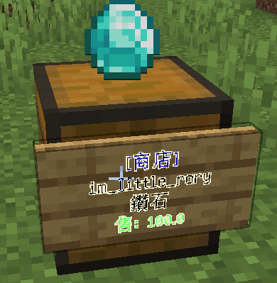

# 🔨 如何建立遊戲內箱子商店

本伺服器採用了全自訂的**聊天欄互動式建立系統**，您無需手動書寫複雜的告示牌內容，只需幾個簡單的步驟即可自動建立一個受保護的交易商店。

---

## 🏪 建立步驟

### 1. 進入建立模式
在遊戲中輸入指令 **`/shop`** 開啟商店箱子選單。點擊下方的 **`§a[建立商店]`** 按鈕（Slot 49，綠色寶石標誌）。
* 點擊後，系統會自動關閉選單，並在聊天欄顯示：`§b[Craft-Core] §a★ 商店建立模式 ★`。
* 您有 30 秒的有效建立時間。

### 2. 綁定箱子與商品
1. 將您想要上架販售的物品**拿在主手（Main Hand）**上。
2. 對著您要用來擺攤的**實體箱子（或木桶）**按 **【左鍵】（即擊打方塊）**。
3. 綁定成功後，聊天欄會顯示：`§b[Craft-Core] §e【步驟 1/2】設定出售價格`。

---

## 💬 3. 聊天欄價格設定

系統會引導您在聊天欄依序輸入價格：

### 【步驟 1/2】設定出售價格 (玩家買您商品的單價)
* 在聊天欄直接輸入正整數（如 `100`），即代表玩家花費 $100 可以買到 1 個該商品。
* 若您的商店**不提供出售**（純粹收購材料），請輸入 **`0`** 或 **`none`**。
* 輸入 **`取消`** 可以放棄建立商店。

### 【步驟 2/2】設定收購價格 (您向玩家回收物品的單價)
* 在聊天欄直接輸入正整數（如 `50`），即代表玩家可以將手上相同的物品以 $50 賣給您（交易款項會從店主您的個人餘額中扣除）。
* 若您的商店**不提供收購**，請輸入 **`0`** 或 **`none`**。
* 輸入 **`取消`** 可以放棄建立商店。

---

## 🎉 4. 建立成功效果

當兩個價格設定完畢且合法後：
1. 系統會自動在箱子上生成一個**告示牌**，並自動填寫好所有商店資訊（格式範例如下圖所示）。
2. 箱子上方會出現 **3D 懸浮的商品模型**，方便其他玩家一眼辨識您的擺攤！
3. 該箱子會自動被系統鎖定保護，防範 any 未經授權的玩家開啟或破壞。

