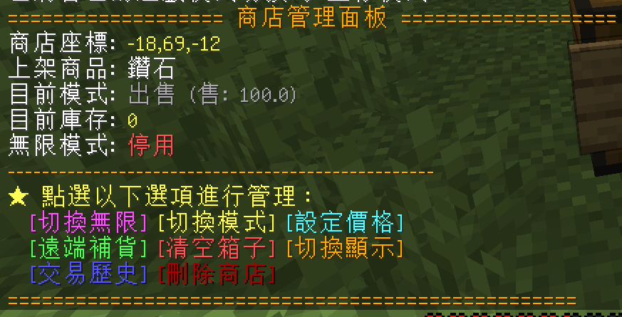

# 🤖 Minecraft 假人掛機系統 (Carpet Bot)

伺服器為所有玩家提供了安全、便捷的假人掛機系統（由 Carpet 模組底層驅動並經過自訂限制），讓您可以在不需要開啟多個 Minecraft 客戶端的情況下，召喚假人登入伺服器掛網、自動刷怪、測試紅石與收集物資。

---

## ⚙️ 1. 假人基本限制與命名

* **名稱前綴自動補全**：
  * 當您輸入名稱時，系統會在前方**自動補上 `fp_`**（例如：`/fp abc` ➡️ 生成假人名稱為 `fp_abc`）。
  * 若您輸入的名稱本身即已包含 `fp_`（不分大小寫，如 `fp_rory`），系統則會直接使用該名稱，不會重複堆疊。
  * 假人名稱有效長度限制（包含 `fp_`）為最長 **16 個字元**。
* **召喚數量限制**：
  * 每位玩家同時只能有 **最多 3 隻** 假人在此線上。
  * 如果已經有 3 隻您的假人，必須先將其中一隻下線才能再召喚新的假人。
* **安全性與擁有權保護**：
  * 每個假人在首次被召喚時都會自動綁定至該玩家的個人名下。
  * **非擁有者**（除管理員/OP 外）無法控制、移動或將其他玩家的假人下線，保障物資與掛機位置的安全。

---

## 💬 2. 遊戲內控制指令

### 召喚與下線 (Spawn & Kill)
* **`/fp <名稱>`** 或 **`/fp <名稱> spawn`**：在您當前所站的位置與維度，召喚一個名為 `fp_<名稱>` 的假人。
* **`/fp <名稱> kill`**：將您的指定假人安全下線。

### 自動化動作 (Attack & Use)
* **`/fp <名稱> attack continuous`**：控制假人**持續左擊**（適用於刷怪塔）。
* **`/fp <名稱> attack interval <ticks>`**：控制假人每隔指定 ticks（20 ticks = 1 秒）攻擊一次。
* **`/fp <名稱> attack once`**：控制假人單次攻擊。
* **`/fp <名稱> use continuous`**：控制假人**持續右擊**（適用於自動種植或餵食）。
* **`/fp <名稱> use interval <ticks>`**：控制假人每隔指定 ticks 右擊。
* **`/fp <名稱> stop`**：**停止**假人正在執行的所有自動化動作與移動。

### 移動與姿態
* **`/fp <名稱> jump`**：使假人跳躍一次。
* **`/fp <名稱> sneak`**：使假人保持**蹲下**姿勢。
* **`/fp <名稱> unsneak`**：使假人取消蹲下。
* **`/fp <名稱> sprint`**：使假人進入疾跑。
* **`/fp <名稱> unsprint`**：使假人停止疾跑。

### 物品操作
* **`/fp <名稱> drop`**：使假人丟棄主手握著的單個物品。
* **`/fp <名稱> dropStack`**：使假人丟棄主手握著的整疊物品。
* **`/fp <名稱> swapHands`**：使假人交換主手與副手物品。

---

## 🖥️ 3. 網頁端遠端控制面板

您也可以在網頁端儀表板的 **「假人控制」** 分頁中遠端管理您名下的假人：
1. **即時名冊**：顯示您擁有的假人狀態、名稱與是否在線。
2. **一鍵召喚**：在輸入框輸入名稱並點選「召喚假人」即可將其召喚上線（**⚠️ 注意**：您本人必須先在遊戲內線上，假人才能降生在您的位置）。
3. **快捷按鈕**：對於在線的假人，提供連續攻擊、右擊使用、停止、跳躍、蹲下、換手等全套控制按鈕，免去在遊戲中手動輸入繁瑣命令！

