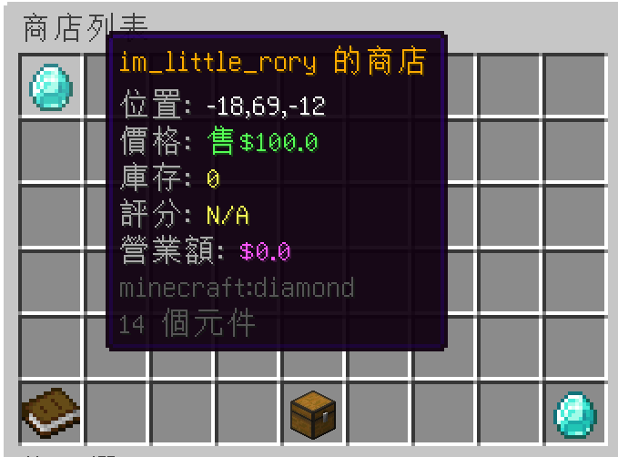
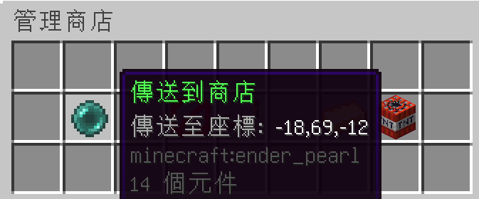

# 🏪 Minecraft 箱子商店系統概覽

箱子商店是伺服器的核心交易系統，讓玩家可以利用一個箱子與一個告示牌輕鬆擺攤賣貨或收購材料。

> [!TIP]
> 推薦您在遊戲中優先輸入 **`/shop`** 指令開啟箱子選單。在此選單中，您可以直觀地瀏覽所有玩家正在販售的商品，並滑鼠點選快速傳送，比起用指令更方便快捷！

---

## 🪙 1. 買家交易操作

* **商品詳細資訊**：當您指針懸停在商品上，或是看著商店告示牌時，系統會顯示該商店的評分與交易詳情。
  
  

* **購買商品**：對著商店的 **告示牌【右鍵】**。會跳出交易對話框，確認後即可購買。
* **出售商品**：對著商店的 **告示牌【左鍵】**。如果商店設有收購模式，您可以將物品賣給店主。

---

## 📈 2. 商店升級與管理

* **商店升級 `/shop upgrade`**：每位玩家預設最多可建立 15 個商店。在遊戲內輸入此指令，消耗 **$5,000 金幣** 即可永久增加 1 個商店建立上限。
* **商店更名 `/shop rename <座標> <自訂名稱>`**：花費 **$5,000 金幣** 將指定座標的商店更名，名稱會同步顯示在告示牌與網頁瀏覽器上。
