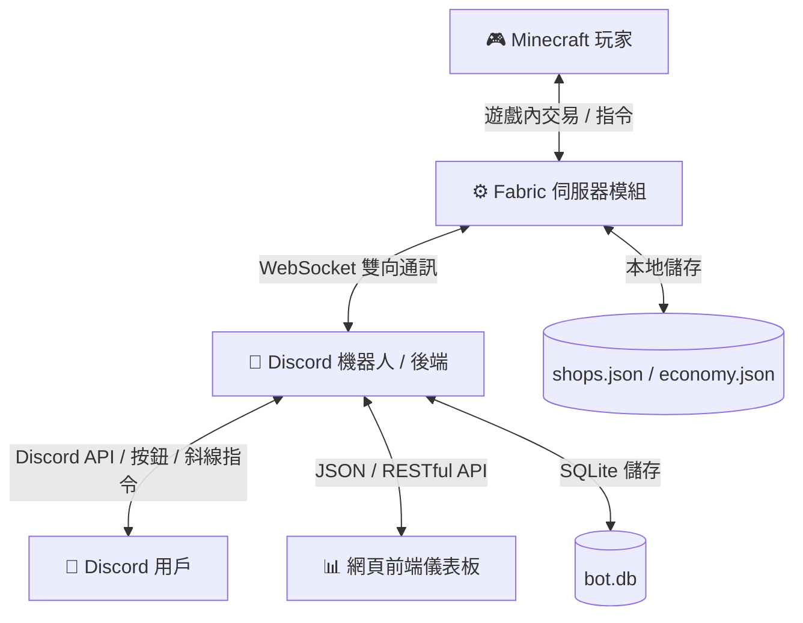

# 📖 CraftCoreShop 官方說明文件首頁

歡迎造訪 **CraftCoreShop** 官方維基與系統指南！本指南旨在協助伺服器管理員與玩家快速熟悉本商店與虛擬經濟系統的核心架構、操作指令及運作原理。

---

## 🌐 系統整體架構圖

本系統由 **Minecraft 伺服器端模組 (Fabric Mod)**、**Discord 機器人 (Discord Bot)** 以及 **網頁前端儀表板 (Web Dashboard)** 三大核心組件構成，透過安全穩定的雙向 WebSocket 通訊協定進行即時資料交換：

---

## 🧭 文件導覽目錄

本說明文件共分為三大單元，您可以點選下方連結深入閱讀各單元的詳細教學：

### 📦 1. 箱子商店系統指南
箱子商店是伺服器自由市場的核心，支援玩家自主擺攤、雙向買賣、預約與評價。
*   📖 [【第一篇】商店建立與設定](Shop-Creation.md) — 啟動建立精靈、手持物品綁定與告示牌發光特效。
*   📖 [【第二篇】買家交易與預約](Shop-Transaction.md) — 聊天欄買賣對話引導、叮音效提示與缺貨預付款預約訂單。
*   📖 [【第三篇】賣家管理與更名](Shop-Management.md) — `/shop` 商店瀏覽選單、提領營業額、商店付費更名與大宗批發模式。

### ⚖️ 2. 經濟與回收系統指南
伺服器內建虛擬貨幣經濟，提供穩定的基礎回收管道與即時市場趨勢分析。
*   📖 [【第四篇】回收與限額機制](Economy-Recycle.md) — `/economy` 回收介面使用、全物資兌換價格表與每日防刷雙上限。
*   📖 [【第五篇】市場均價與趨勢](Market-Analytics.md) — `/market` 商品成交均價統計與 7 日漲跌趨勢看板。

### 🛠️ 3. 管理員與維護指南
針對伺服器管理員（OP）提供的特權操作與安全維護機制。
*   📖 [【第六篇】管理員與指令手冊](Admin-Manual.md) — OP 專屬金幣增減指令、系統無限商店（Server Shop）建立與違規商店強制註銷。

---

## ⚙️ 系統基本需求與安裝

### 遊戲伺服器端
- **Minecraft 版本**：`1.21.1` / `26.2 (Chaos Cubed)`
- **平台與加載器**：Fabric Loader (版本 `0.16.0` 以上)
- **依賴項**：純伺服器端運行，玩家客戶端**無需安裝任何模組或資源包**。

### 網頁與機器人端
- **運行環境**：Node.js `v18` 或以上
- **管理工具**：內建 PM2 整合腳本，可透過雙擊根目錄 `start_all.bat` 一鍵在背景啟動所有組件。
