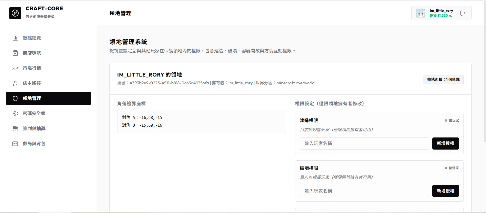

# 🛡️ 領地防護與網頁端權限管理

為了防止其他玩家在未經授權的情況下開啟您的箱子或破壞您的建築，本伺服器提供了強大的**領地保護系統**。您可以在遊戲內設定保護區域，並於網頁端進行精細的共建授權。

---

## 🎮 1. 遊戲內建立領地流程

### 【第一步】取得工具與框選範圍
1. 合成或取得一支 **木鋤 (Wooden Hoe)** 拿在手上。
2. 對著想要設定為保護區範圍的**角落 A 方塊按【左鍵】**，聊天欄會顯示：`§b[Craft-Core] §f已設定角落 A: X, Y, Z`。
3. 對著另一個對角線的**角落 B 方塊按【右鍵】**，聊天欄會顯示：`§b[Craft-Core] §f已設定角落 B: X, Y, Z`。
4. 框選完成後，系統會自動在聊天欄提示該範圍跨越的區塊數量與計費：
   * `§b[Craft-Core] §f選取區域跨越了 X 個區塊 (Chunk)。總計費用: §e$Y§f 元。`
   * **計費規則**：每個區塊（16x16）收費 **$30 遊戲幣**。

### 【第二步】確認購買領地
* 在聊天欄輸入指令 **`/claim`** 即可扣除您的個人餘額並成功購買該領地。
* 購買成功後，該範圍（從基岩到天空頂端）即會建立防護。其他玩家預設將無法在該區域內放置、破壞方塊或開啟容器。

---

## 🖥️ 2. 網頁端精細好友權限配置

登入網頁儀表板後，點選 **「領地管理」**，即可在網頁上直觀管理您名下的所有領地：

* **領地資訊**：卡片會列出您的領地 ID、座標範圍與所屬世界維度。
* **新增好友權限**：在領地卡片中輸入好友的 Minecraft ID，並為其勾選以下核心權限：
  1. **Build (建造)**：是否允許在領地內放置方塊。
  2. **Break (破壞)**：是否允許在領地內敲除方塊。
  3. **Containers (容器)**：是否允許開啟領地內的箱子、熔爐、木桶等儲存容器。
  4. **Interact (互動)**：是否允許點擊按鈕、踩踏壓力板、拉拉桿或開門。
* **撤銷授權**：您可以隨時在網頁上一鍵取消勾選，或點選刪除撤銷該好友的所有權限。

