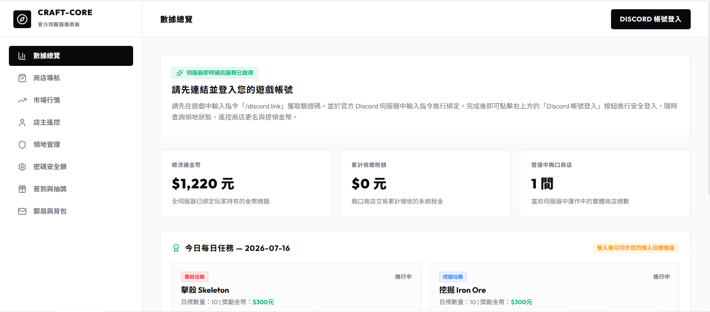

# 🖥️ 網頁版首頁與帳號登入

本伺服器提供全功能網頁儀表板，支援跨平台即時查詢伺服器經濟、個人數據與遊戲即時狀態。

---

## 🔑 1. 帳號登入與綁定

為了保障您的虛擬資產安全，系統已啟用 Discord 安全綁定機制：
1. 點選網頁右上角的 **`[ 以 Discord 帳號登入 ]`** 按鈕。
2. 授權登入後，系統會自動尋找您在遊戲內綁定的 Minecraft 角色。
3. **未綁定提示**：若您的帳號尚未綁定，請先登入遊戲內，輸入 `/discord link` 獲取一組 6 位數驗證碼，並至官方 Discord 頻道進行綁定。

---

## 🏠 2. 首頁核心看板

登入網頁首頁後，您可以直觀查閱以下即時數據：
* **💰 全服流通金幣**：目前伺服器中所有玩家持有的金幣總額。
* **🏛️ 累計收繳稅額**：顯示商店交易已被系統回收並銷毀的 5% 印花稅金幣總量。
* **🏪 營運中胸口商店**：當前全伺服器正在營業的玩家商店總數量。
* **🟢 遊戲即時狀態**：
  - **線上燈號**：即時顯示您目前在遊戲中是「線上」或「離線」。
  - **遊戲內座標**：您在線時，即時同步顯示您的三維世界座標 (X, Y, Z)。
  - **遊戲內餘額**：即時與遊戲內同步您的金幣總值。
  - **伺服器 TPS**：實時反映伺服器的運作效率（滿分 20.00）。
* **🏆 富豪排行榜**：顯示全服金幣餘額前 10 名的玩家排行榜，並載入其皮膚頭像。
* **🛒 即時交易動態**：免重新整理，即時推播全服最新的商店成交紀錄。
