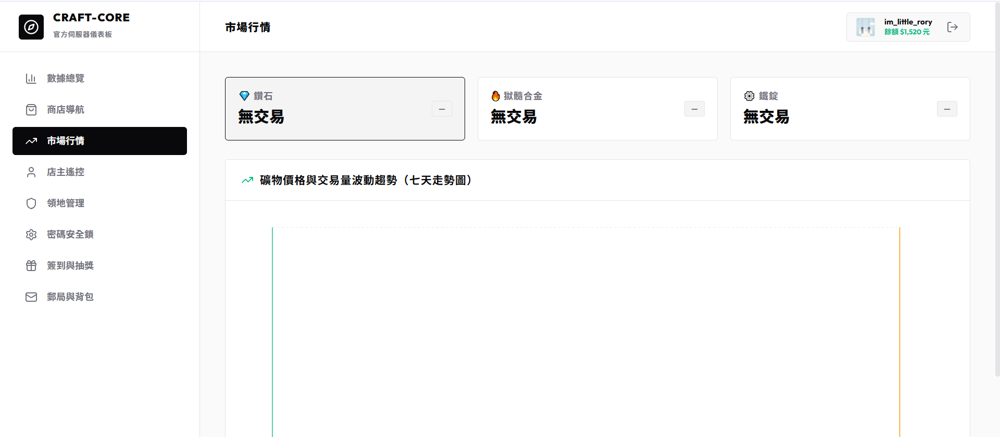

# ⚖️ 全服市場行情與均價走勢

本伺服器設有大數據市場分析系統，收集每一次的玩家交易，並在網頁端提供實時行情展示。

---

## 📈 1. 今日成交均價與趨勢

在 **「市場行情」** 面板中，系統會自動統計每種物品的交易價格：
* **今日均價**：根據今日全服成交的所有紀錄，計算出該物品的平均交易價格，防止物價惡性通貨膨脹。
* **7日物價走勢圖**：展示過去 7 天內，特定熱門物資（如鑽石、鐵錠、黃金）的成交價格走勢，提供精確的商業投資參考。

---

## ♻️ 2. 全服回收機制與限額

為維護基礎物價，伺服器提供官方回收管道：
* **每日回收限額**：每位玩家每日出售給系統商店的金額設有上限，額度於每日凌晨 0:00 重設。
* **動態價格保護**：如果全服短時間內大量拋售同一種物品，系統回收價格會自動微幅調降；反之若缺乏該物品，回收價會調高。
