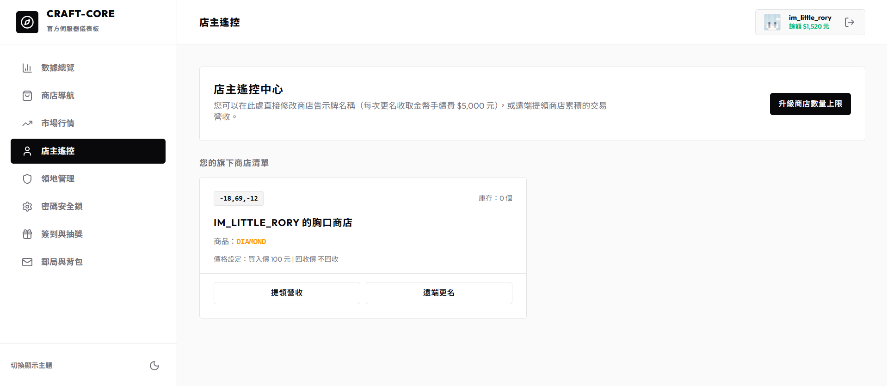

# 📲 網頁端店主遠端遙控中心

做為商店主人，您不需要親自跑回店面，即可在網頁端對您的所有箱子商店進行全面管理。

---

## 💰 1. 遠端提領商店營收

當其他玩家向您的商店購買商品時，交易獲得的遊戲幣會暫存於商店箱子中。
* 在網頁端的 **「店主遙控」** 面板中，點擊對應商店卡片底部的 **`[ 提領營收 ]`** 按鈕。
* 系統會將該商店累積的營收金幣，即時匯入您的玩家帳戶餘額中。

---

## 🏷️ 2. 遠端商店告示牌更名

* 點選商店卡片底部的 **`[ 遠端更名 ]`** 按鈕。
* 輸入新的商店自訂名稱（例如 `神裝專賣店`，長度限 20 字內）並確認。
* **注意**：每次遠端更改告示牌名稱需要支付 **$5,000 遊戲幣** 手續費。

---

## 📈 3. 升級商店數量上限

* 點選遙控中心頂端的 **`[ 升級商店數量上限 ]`** 按鈕。
* 系統會扣除您的個人金幣 **$5,000 元**，並永久為您增加 **1 個** 商店建立額度上限（初始上限為 15 個）。
