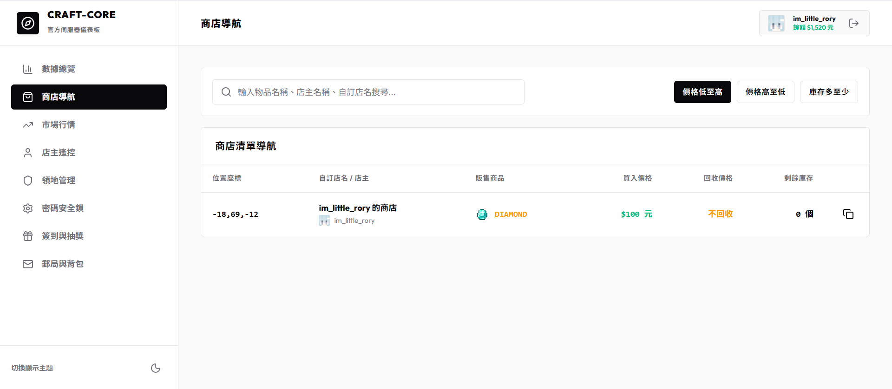

# 🔍 網頁端商店導航與瀏覽

玩家可以使用網頁版「商店瀏覽器」，快速尋找並導航至全服的所有玩家擺攤。

---

## 🛍️ 1. 商店列表與搜尋

在網頁端 **「商店瀏覽器」** 頁面中：
* **即時列表**：系統會羅列出目前所有營業中的玩家箱子商店。
* **商品搜尋**：在搜尋欄中輸入關鍵字，即可快速篩選指定商品（如 `DIAMOND`、`GLASS` 等）。
* **排序功能**：支援依照價格（從低到高/從高到低）或庫存剩餘量進行排序，方便貨比三家。

---

## 🧭 2. 遊戲內快速傳送導航

當您在網頁上找到心儀的商店後：
1. 點擊商店卡片上的 **「座標標籤」**（例如 `100, 64, -200`）。
2. 系統會自動複製遊戲內的傳送指令 `/shop control <座標>` 至您的剪貼簿。
3. 進入遊戲，打開聊天欄貼上並送出指令，即可瞬間傳送至該商店前進行交易！
